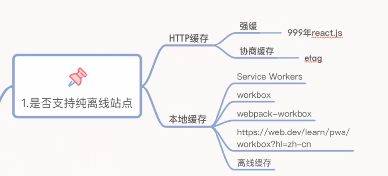
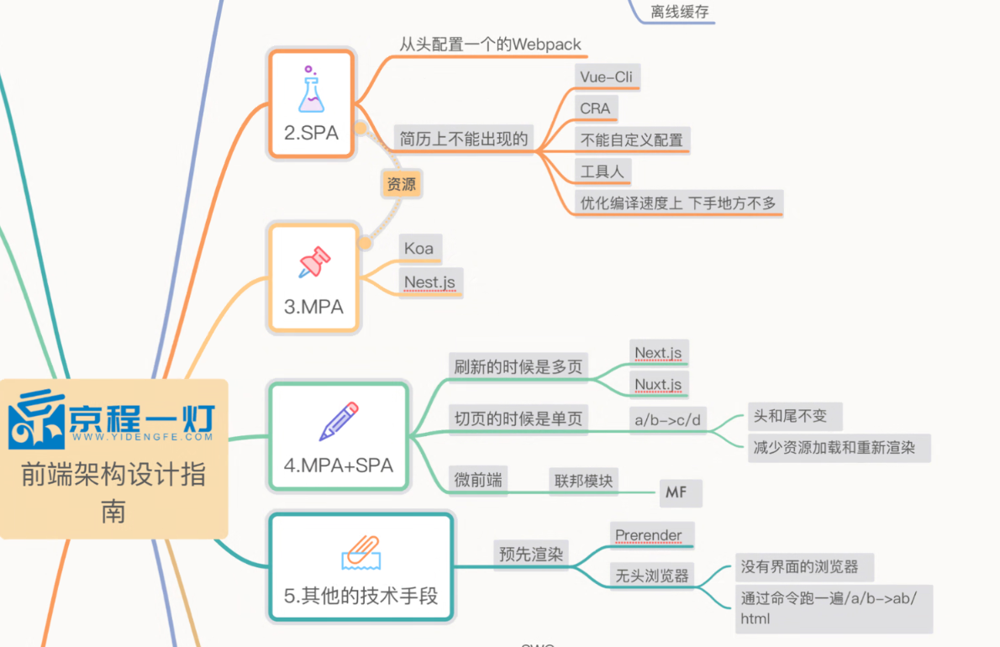

### DApp的开发分成 去中心化 和 半中心化（带着数据库和服务器）
去中心化不带数据库和服务器，部署在ipfs上

### ssr服务端渲染比csr客户端渲染快
js会阻塞html的渲染，js如果大了，阻塞的时间就长，html渲染的就很慢
ssr是直接在服务端生成渲染好的html，直接返回，然后在后台下载js，之后再让页面动态化

### serverless(无服务)
前100万请求是免费的，
传统EC2要测QBS，公司有多少用户，能承载多大访问，然后要去买服务器，配置K8S实现负载均衡（开发成本和用户成本很高）
serverless是租的服务器，别人服务器空闲了，他就用人家空闲的部分，再给人家退一部分租金。他弹性集群自己会扩容

### 三个next.js
next.js做react
nest.js做服务端渲染
nuxt.js做vue的（很少用）

### 简历写法
监控 性能 node 工程化  微前端  docker配置前端配置文件
v8 浏览器 图形学 webgpu wsam 音视频

three xeogl 3d模型load进来，转一转，打个光

service workers可以做离线，但是基本上用封装好滴的webpack workbox

### 工程提效
使用LangChain.js开发AIAgents进行工程提效节省工时140工时（小学生通）
.spec.ts 单元测试(我草，这个ai能写啊)，让同事把需要单元测试的代码给你
d.ts 需要接口给你（我尼玛裂开，傻逼ts的接口返回值类型，可以直接在quicktype网站生成 https://app.quicktype.io/
封装组件库，figma生成业务代码

### ts帮v8提前做了typechek
function(a){},a一开始一直传数字，突然有一次传了字符串，直接裂开，进行反编译，反优化（是不是这个词我忘记了）

### SPA
解析域名DNS，握手，先返回一个空的html，屁用没有，然后去找react的库，再去找react相关生态，再去找libs（二次组件封装），还是p用没有
再去找main.js（有些sb，能达到5M，导致白屏，解决白屏就是让main.js变小，异步请求），这一步还是p用没有，页面没加载出来
再去找route.js，fetch回来，虚拟dom，虚拟dom映射到dom，再生成个什么东西，1:39

SPA唯一的好处，head、footer不重新渲染

800年前的MPA，切换要重新加载head，footer

现在的前端路由是假的路由，php真路由，他会去找有没有这个

前端就这四种方案

loader和plugin，统计出来谁慢，这时候用rust（雪狼班才能学）
rust

